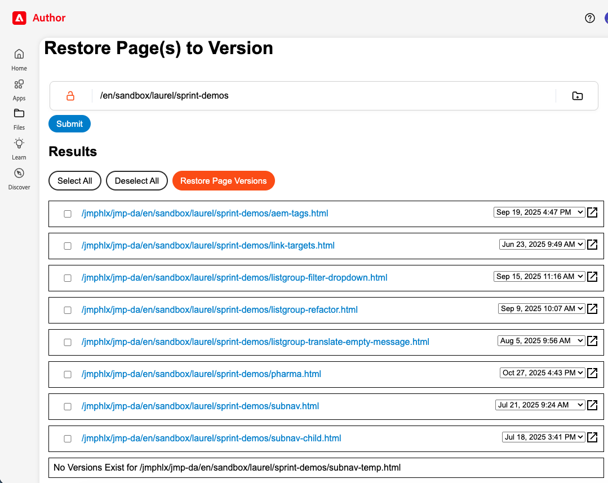
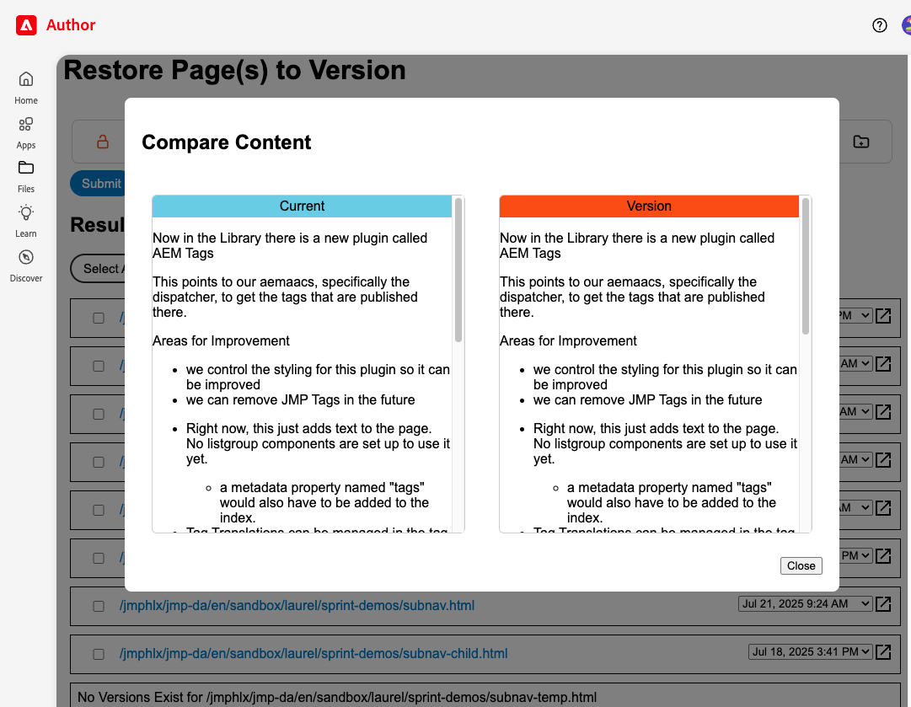

# 🕰️ Page Rewind — Visual Compare & Fast Restore

A fast, intuitive tool to view, compare, and restore page versions at scale — perfect for large content rollbacks in AEM / DA workflows.

## 🚀 What Is This?

Page Rewind is a utility that enables authors and content engineers to:
- Browse the full version history of a page
- Visually compare a selected version to the current published state
- Restore an older version confidently and efficiently

This tool is especially valuable for large-scale content rollbacks and rapid recovery after editorial, taxonomy, or automation-driven changes.

DA natively supports page versioning and comparisons, but Page Rewind streamlines these actions into an author-friendly workflow tailored for high-volume rollback scenarios. 

## 📌 Features

- Version history list – Shows all saved page versions
- Visual diff view – Identify what changed between two versions
- Fast restore workflow – Revert to a prior version
- Scalability - Restore multiple pages at once
- Integrates with [Page Tree Viewer app](https://github.com/jmphlx/jmp-da/tree/main/tools/pagetree) - allow author to navigate through content to find target

## 🖼️ Screenshots

## 🧠 How It Works (Overview)

1. Select a page — choose any path you want to inspect

2. Fetch pages and versions — system retrieves available history

3. Compare — view differences between the current page and a chosen version

4. Restore — select one or more results from the list to apply the selected version as the new current version

5. Update UI - when a restoration is completed successfully, the result in the result list turns green. If it fails, it turns red.

This mirrors and simplifies AEM’s core versioning capabilities — compare and restore — in a way that’s easy to reuse in bulk or when rollback speed matters. 

## 🔐 Safety & Guardrails

- DA Permissions should restrict restore access appropriately
- Clear success/failure indicators
- Optional - integrate with [custom access control for applications](https://github.com/aemsites/da-blog-tools/tree/main/tools/access-control)

## ⚠️ Limitations

- Compare may include generated markup noise
- Only works where version history exists
- Restore depends on environment permissions and version availability
- When using the Page Tree View app - when selecting a page path, you need to select at least one level above the desired page. You cannot specify a path to a singular page.

## 📈 Possible Improvements

- Add Create Version button to each card to create a version of the page as it is. 
- Add Refresh button to refresh the list of versions for a single page
- Could add a link to the card to open the page in author in a new tab.
- Add number of selected pages to the results header.
- Add highlighting to differences between 2 versions.
